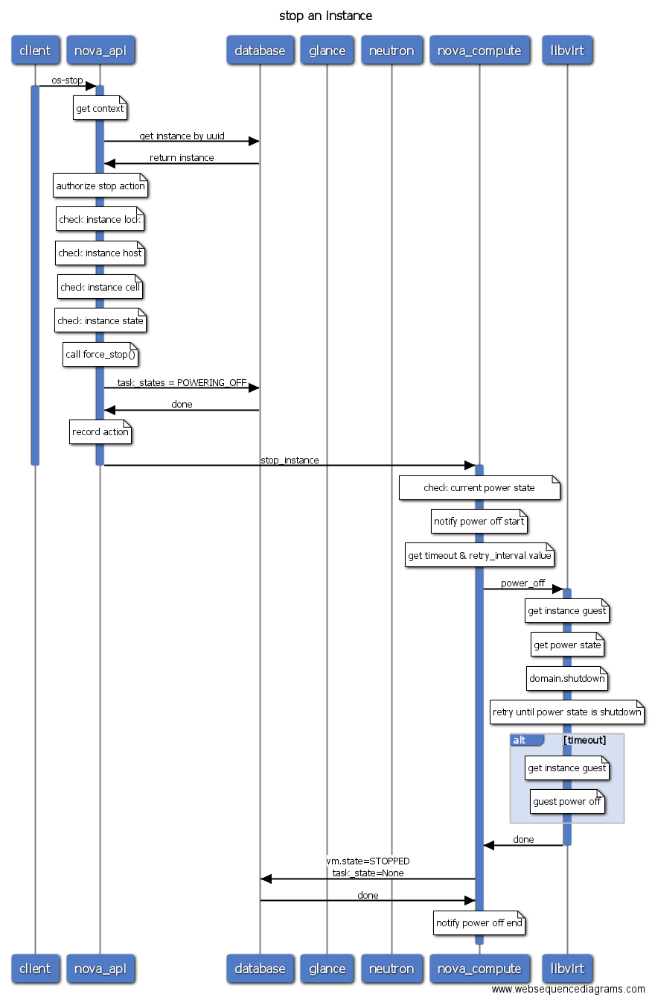

# Openstack Sequence Diagrams

Draw Openstack operation sequence diagrams using [Websequence Diagrams Tool](https://www.websequencediagrams.com/). An easiest way to track the workflow of Openstack. It may be useful for user to learn Openstack or problem troubleshooting. 

## Quick start


### 1. Generate diagrams

To compile the diagrams on your localhost, ensure that your machine can access the Internet and the `make` tools hava been correctly installed.

```
make
```

All diagrams generated will be put in `./output` by default, use your image viewer to show.

### 2. Remove diagrams

To cleanup the diagrams, just run this:

```
make clean
```


## Some demo

### 1. Create Server Workflow


### 2. Reboot Server

 


### 3. Stop Server




## Need more diagrams ?

DYI, as you need!

## License 

MIT
