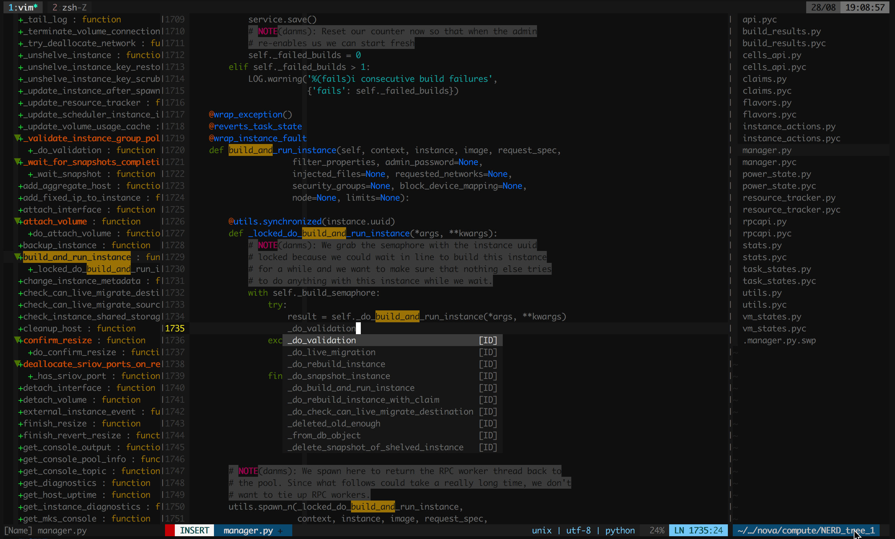
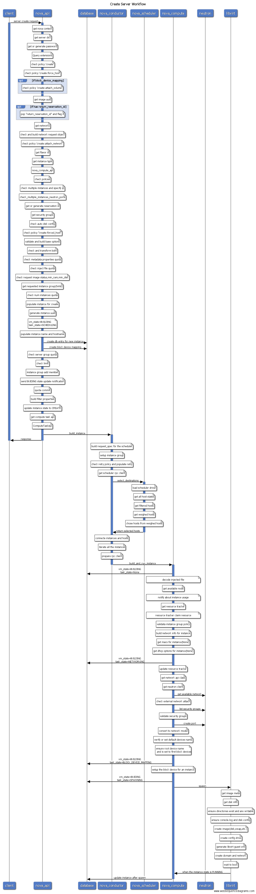
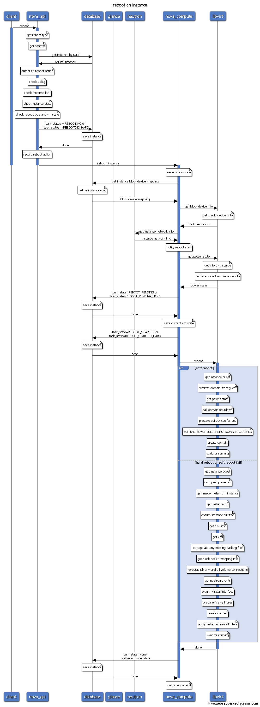
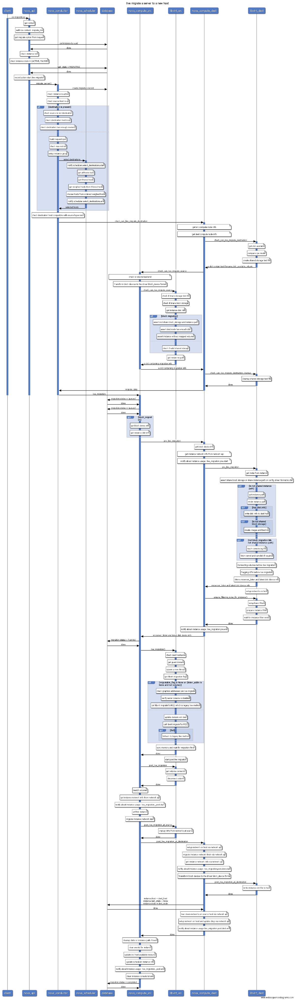

[👉English](./README.md)

## 1 关于该项目

本项目使用在线绘图工具[web sequencediagrams](https://www.websequencediagrams.com/)完成，目标是图形化OpenStack的所有操作流程，通过操作序列图能快速学习Openstack的工作原理，理清各个组件的关系，运维人员也能根据操作序列图进行更精确的故障定位和排查.

注意，该操作序列图基于L版OpenStack源码，未来版本的操作可能会有变化，请以最新版的源码为准，该项目提供的序列图仅供参考。

## 2 OpenStack基础

### 2.1 OpenStack组件介绍

OpenStack是一个IaaS层的云计算平台开源实现，其对标产品为AWS。最开始OpenStack只有两个组件，分别为提供计算服务的Nova以及提供对象存储服务的Swift，其中Nova不仅提供计算服务，还包含了网络服务、块存储服务、镜像服务以及裸机管理服务。之后随着项目的不断发展，从Nova中根据功能拆分为多个独立的项目，如nova-volume拆分为Cinder项目提供块存储服务，nova-image拆分为Glance项目，提供镜像存储服务，nova-network则是neutron的前身，裸机管理也从Nova中分离出来为Ironic项目。最开始容器服务也是由Nova提供支持的，作为Nova的driver之一来实现，而后迁移到Heat，到现在已经独立为一个单独的项目Magnum，后来Magnum的愿景调整为主要提供容器编排服务，单纯的容器服务则由Zun项目接管。最开始OpenStack并没有认证功能，从E版开始才加入认证服务Keystone。

目前OpenStack核心组件如下:

* Keystone：认证服务。
* Glance：镜像服务。
* Nova：计算服务。
* Cinder：块存储服务。
* Neutorn：网络服务。
* Swift：对象存储服务。

E版之后，在这些核心服务之上，又不断涌现新的服务，如面板服务Horizon、编排服务Heat、数据库服务Trove、文件共享服务Manila、大数据服务Sahara以及前面提到的Magnum等，这些服务几乎都依赖于以上的核心服务。比如Sahara大数据服务会先调用Heat模板服务，Heat又会调用Nova创建虚拟机，调用Glance获取镜像，调用Cinder创建数据卷，调用Neutron创建网络等。

截至现在（2016年11月27日），OpenStack已经走过了6年半的岁月，最新发布的版本为第14个版本，代号为Newton，Ocata版已经处在快速开发中。

OpenStack服务越来越多、越来越复杂，覆盖的技术生态越来越庞大，宛如一个庞然大物，刚接触如此庞大的分布式系统，都或多或少感觉有点如"盲人摸象"的感觉。不过不必先过于绝望，好在OpenStack项目具有非常良好的设计，虽然OpenStack项目众多，组件繁杂，但几乎所有的服务骨架脉络基本是一样的，熟悉了其中一个项目的架构，深入读了其中一个项目源码，再去看其它项目可谓轻车熟路。

本文档会以Nova项目为例，一步一步剖析源码结构，阅读完之后，你再去看Cinder项目，发现非常轻松。

### 2.2 工欲善其事必先利其器

要阅读源代码首先需要安装科学的代码阅读工具，图形界面使用pycharm没有问题，不过通常在虚拟机中是没有图形界面的，首选vim，需要简单的配置使其支持代码跳转和代码搜索，可以参考[GitHub - int32bit/dotfiles: A set of vim, zsh, git, and tmux configuration files.](https://github.com/int32bit/dotfiles)。如图：



OpenStack所有项目都是基于Python开发，都是标准的Python项目，通过setuptools工具管理项目，负责Python包的安装和分发。想知道一个项目有哪些服务组成，入口函数（main函数）在哪里，最直接的方式就是查看项目根目录下的`setup.cfg`文件，其中`console_scripts`就是所有服务组件的入口，比如nova的`setup.cfg`的`console_scripts`如下:

```
[entry_points]
...
console_scripts =
    nova-all = nova.cmd.all:main
    nova-api = nova.cmd.api:main
    nova-api-metadata = nova.cmd.api_metadata:main
    nova-api-os-compute = nova.cmd.api_os_compute:main
    nova-cells = nova.cmd.cells:main
    nova-cert = nova.cmd.cert:main
    nova-compute = nova.cmd.compute:main
    nova-conductor = nova.cmd.conductor:main
    nova-console = nova.cmd.console:main
    nova-consoleauth = nova.cmd.consoleauth:main
    nova-dhcpbridge = nova.cmd.dhcpbridge:main
    nova-idmapshift = nova.cmd.idmapshift:main
    nova-manage = nova.cmd.manage:main
    nova-network = nova.cmd.network:main
    nova-novncproxy = nova.cmd.novncproxy:main
    nova-rootwrap = oslo_rootwrap.cmd:main
    nova-rootwrap-daemon = oslo_rootwrap.cmd:daemon
    nova-scheduler = nova.cmd.scheduler:main
    nova-serialproxy = nova.cmd.serialproxy:main
    nova-spicehtml5proxy = nova.cmd.spicehtml5proxy:main
    nova-xvpvncproxy = nova.cmd.xvpvncproxy:main
...
```

由此可知nova项目安装后会包含21个可执行程序，其中nova-compute服务的入口函数为`nova/cmd/compute.py`(. -> /)模块的`main`函数:

```python
def main():
    config.parse_args(sys.argv)
    logging.setup(CONF, 'nova')
    utils.monkey_patch()
    objects.register_all()

    gmr.TextGuruMeditation.setup_autorun(version)

    if not CONF.conductor.use_local:
        block_db_access()
        objects_base.NovaObject.indirection_api = \
            conductor_rpcapi.ConductorAPI()
    else:
        LOG.warning(_LW('Conductor local mode is deprecated and will '
                        'be removed in a subsequent release'))

    server = service.Service.create(binary='nova-compute',

由于OpenStack使用python语言开发，而python是动态类型语言，参数类型不容易从代码中看出，因此必须部署一个allinone的OpenStack开发测试环境，建议使用RDO部署：[Packstack quickstart](https://www.rdoproject.org/install/quickstart/)，当然乐于折腾使用Devstack也是没有问题的。

要想深入研究源码，最有效的方式就是一步一步跟踪代码执行，因此会使用debug工具是关键技能之一。python的debug工具有很多，为了简便起见，pdb工具就够了。使用方法也非常简单，只要在你想设置断点的地方，嵌入以下代码：

```
import pdb; pdb.set_trace()
```

然后在命令行（不能通过systemd执行）直接运行服务即可。假如想跟踪nova创建虚拟机的过程，首先在`nova/api/openstack/compute/servers.py`模块的`create`方法打上断点，如下：

```python
@wsgi.response(202)
    @extensions.expected_errors((400, 403, 409, 413))
    @validation.schema(schema_server_create_v20, '2.0', '2.0')
    @validation.schema(schema_server_create, '2.1', '2.18')
    @validation.schema(schema_server_create_v219, '2.19')
    def create(self, req, body):
        """Creates a new server for a given user."""

        import pdb; pdb.set_trace() # 设置断点
        context = req.environ['nova.context']
        server_dict = body['server']
        password = self._get_server_admin_password(server_dict)
        name = common.normalize_name(server_dict['name'])

        if api_version_request.is_supported(req, min_version='2.19'):
            if 'description' in server_dict:
                # This is allowed to be None
                description = server_dict['description']
            else:
                # No default description
                description = None
        else:
            description = name
        ...
```

然后注意需要通过命令行直接运行，而不是通过systemd启动:

```
su -c 'nova-api' nova
```

此时调用创建虚拟机API，nova-api进程就会马上弹出pdb shell，此时你可以通过`s`或者`n`命令一步一步执行了。

### 2.3 OpenStack项目通用骨骼脉络

阅读源码的首要问题就是就要对代码的结构了然于胸，**需要强调的是，OpenStack项目的目录结构并不是根据组件严格划分，而是根据功能划分**，以Nova为例，compute目录并不是一定在nova-compute节点上运行，而主要是和compute相关(虚拟机操作相关）的功能实现，同样的，scheduler目录代码并不全在scheduler服务节点运行，但主要是和调度相关的代码。不过目录结构并不是完全没有规律，它遵循一定的套路。

通常一个服务的目录都会包含`api.py`、`rpcapi.py`、`manager.py`，这个三个是最重要的模块。

* `api.py`： 通常是供其它组件调用的封装库。换句话说，该模块通常并不会由本模块调用。比如compute目录的api.py，通常由nova-api服务的controller调用。
* rpcapi.py：这个是RPC请求的封装，或者说是RPC封装的client端，该模块封装了RPC请求调用。
* manager.py： 这个才是真正服务的功能实现，也是RPC的服务端，即处理RPC请求的入口，实现的方法通常和rpcapi实现的方法一一对应。

比如对一个虚拟机执行关机操作：

```
API节点
nova-api接收用户请求 -> nova-api调用compute/api.py -> compute/api调用compute/rpcapi.py -> rpcapi.py向目标计算节点发起stop_instance()RPC请求

计算节点
收到stop_instance()请求 -> 调用compute/manager.py的callback方法stop_instance() -> 调用libvirt关机虚拟机

```

前面提到OpenStack项目的目录结构是按照功能划分的，而不是服务组件，因此并不是所有的目录都能有对应的组件。仍以Nova为例:

* cmd：这是服务的启动脚本，即所有服务的main函数。看服务怎么初始化，就从这里开始。
* db: 封装数据库访问，目前支持的driver为sqlalchemy。
* conf：Nova的配置项声明都在这里。
* locale: 本地化处理。
* image: 封装Glance调用接口。
* network: 封装网络服务接口，根据配置不同，可能调用nova-network或者neutron。
* volume: 封装数据卷访问接口，通常是Cinder的client封装。
* virt: 这是所有支持的hypervisor驱动，主流的如libvirt、xen等。
* objects: 对象模型，封装了所有实体对象的CURD操作，相对以前直接调用db的model更安全，并且支持版本控制。
* policies： policy校验实现。
* tests: 单元测试和功能测试代码。

以上同样适用于其它服务，比如Cinder等。

另外需要了解的是，所有的API入口都是从xxx-api开始的，RESTFul API是OpenStack服务的唯一入口，也就是说，阅读源码就从api开始。而api组件也是根据实体划分的，不同的实体对应不同的controller，比如servers、flavors、keypairs等，controller的index方法对应list操作、show方法对应get操作、create创建、delete删除、update更新等。

根据进程阅读源码并不是什么好的实践，因为光理解服务如何初始化、如何通信、如何发送心跳等就不容易，各种高级封装太复杂了。我认为比较好的阅读源码方式是追踪一个任务的执行过程，比如看启动虚拟机的整个流程，因此接下来本文将以创建一台虚拟机为例，一步步分析其过程。

## 3 创建虚拟机过程分析

这里以创建虚拟机过程为例，根据前面的总体套路，一步步跟踪其执行过程。需要注意的是，Nova支持同时创建多台虚拟机，因此在调度时需要选择多个宿主机。

### S1 nova-api

入口为nova/api/openstack/compute/servers.py的create方法，该方法检查了一堆参数以及policy后，调用`compute_api`的create方法。

```python
def create(self, req, body):
    """Creates a new server for a given user."""

    context = req.environ['nova.context']
    server_dict = body['server']
    password = self._get_server_admin_password(server_dict)
    name = common.normalize_name(server_dict['name'])

    ...

    flavor_id = self._flavor_id_from_req_data(body)
    try:
        inst_type = flavors.get_flavor_by_flavor_id(
                flavor_id, ctxt=context, read_deleted="no")

        (instances, resv_id) = self.compute_api.create(context,
                        inst_type,
                        image_uuid,
                        display_name=name,
                        display_description=description,
                        availability_zone=availability_zone,
                        forced_host=host, forced_node=node,
                        metadata=server_dict.get('metadata', {}),
                        admin_password=password,
                        requested_networks=requested_networks,
                        check_server_group_quota=True,
                        **create_kwargs)
    except (exception.QuotaError,
            exception.PortLimitExceeded) as error:
        raise exc.HTTPForbidden(
            explanation=error.format_message())
```

这里的`compute_api`即前面说的`nova/compute/api.py`模块，找到该模块的create方法，该方法会创建数据库记录、检查参数等，然后调用`compute_task_api`的`build_instances`方法:

```python
self.compute_task_api.schedule_and_build_instances(
    context,
    build_requests=build_requests,
    request_spec=request_specs,
    image=boot_meta,
    admin_password=admin_password,
    injected_files=injected_files,
    requested_networks=requested_networks,
    block_device_mapping=block_device_mapping)
```

`compute_task_api`即conductor的api.py。conductor的api并没有执行什么操作，直接调用了`conductor_compute_rpcapi`的`build_instances`方法:

```python
def schedule_and_build_instances(self, context, build_requests,
                                 request_spec, image,
                                 admin_password, injected_files,
                                 requested_networks, block_device_mapping):
    self.conductor_compute_rpcapi.schedule_and_build_instances(
        context, build_requests, request_spec, image,
        admin_password, injected_files, requested_networks,
        block_device_mapping)

```

该方法即时conductor RPC调用api，即`nova/conductor/rpcapi.py`模块，该方法除了一堆的版本检查，剩下的就是对RPC调用的封装，代码只有两行:

```
cctxt = self.client.prepare(version=version)
cctxt.cast(context, 'build_instances', **kw)
```

其中cast表示异步调用，`build_instances`是远程调用的方法，`kw`是传递的参数。参数是字典类型，没有复杂对象结构，因此不需要特别的序列化操作。

截至到现在，虽然目录由`api->compute->conductor`，但仍在nova-api进程中运行，直到cast方法执行，该方法由于是异步调用，因此nova-api任务完成，此时会响应用户请求，虚拟机状态为`building`。

### S2 nova-conductor

由于是向nova-conductor发起的RPC调用，而前面说了接收端肯定是`manager.py`，因此进程跳到`nova-conductor`服务，入口为`nova/conductor/manager.py`的`build_instances`方法，该方法首先调用了`_schedule_instances`方法，该方法调用了`scheduler_client`的`select_destinations`方法:

```python
def _schedule_instances(self, context, request_spec, filter_properties):
    scheduler_utils.setup_instance_group(context, request_spec,
                                         filter_properties)
    # TODO(sbauza): Hydrate here the object until we modify the
    # scheduler.utils methods to directly use the RequestSpec object
    spec_obj = objects.RequestSpec.from_primitives(
        context, request_spec, filter_properties)
    hosts = self.scheduler_client.select_destinations(context, spec_obj)
    return hosts
```

`scheduler_client`和`compute_api`以及`compute_task_api`都是一样对服务的client调用，不过scheduler没有`api.py`，而是有个单独的client目录，实现在client目录的`__init__.py`，这里仅仅是调用query.py下的SchedulerQueryClient的`select_destinations`实现，然后又很直接的调用了`scheduler_rpcapi`的`select_destinations`方法，终于又到了RPC调用环节。

```python
def select_destinations(self, context, spec_obj):
    """Returns destinations(s) best suited for this request_spec and
    filter_properties.

    The result should be a list of dicts with 'host', 'nodename' and
    'limits' as keys.
    """
    return self.scheduler_rpcapi.select_destinations(context, spec_obj)
```

毫无疑问，RPC封装同样是在scheduler的rpcapi中实现。该方法RPC调用代码如下:

```
return cctxt.call(ctxt, 'select_destinations', **msg_args)
```

注意这里调用的call方法，即同步RPC调用，此时nova-conductor并不会退出，而是堵塞等待直到nova-scheduler返回。因此当前状态为nova-conductor为blocked状态，等待nova-scheduler返回，nova-scheduler接管任务。

### S3 nova-scheduler

同理找到scheduler的manager.py模块的`select_destinations`方法，该方法会调用driver方法，这里的driver其实就是调度算法实现，通常用的比较多的就是`filter_scheduler`的，对应`filter_scheduler.py`模块，该模块首先通过`host_manager`拿到所有的计算节点信息，然后通过filters过滤掉不满足条件的计算节点，剩下的节点通过weigh方法计算权值，最后选择权值高的作为候选计算节点返回。最后nova-scheduler返回调度结果的hosts集合，任务结束，返回到nova-conductor服务。

### S4 nova-condutor

回到`scheduler/manager.py`的`build_instances`方法，nova-conductor等待nova-scheduler返回后，拿到调度的计算节点列表。因为可能同时启动多个虚拟机，因此循环调用了`compute_rpcapi`的`build_and_run_instance`方法。

```python
for (instance, host) in six.moves.zip(instances, hosts):
    instance.availability_zone = (
        availability_zones.get_host_availability_zone(context,
                                                      host['host']))
    try:
        # NOTE(danms): This saves the az change above, refreshes our
        # instance, and tells us if it has been deleted underneath us
        instance.save()
    except (exception.InstanceNotFound,
            exception.InstanceInfoCacheNotFound):
        LOG.debug('Instance deleted during build', instance=instance)
        continue
    ...
    self.compute_rpcapi.build_and_run_instance(context,
            instance=instance, host=host['host'], image=image,
            request_spec=request_spec,
            filter_properties=local_filter_props,
            admin_password=admin_password,
            injected_files=injected_files,
            requested_networks=requested_networks,
            security_groups=security_groups,
            block_device_mapping=bdms, node=host['nodename'],
            limits=host['limits'])
```

看到xxxrpc立即想到对应的代码位置，位于`compute/rpcapi`模块，该方法向nova-compute发起RPC请求:

```
cctxt.cast(ctxt, 'build_and_run_instance', ...)
```

由于是cast调用，因此发起的是异步RPC，因此nova-conductor任务结束，紧接着终于轮到nova-compute登场了。

### S5 nova-compute

到了nova-compute服务，入口为compute/manager.py，找到`build_and_run_instance`方法，该方法调用了driver的spawn方法，这里的driver就是各种hypervisor的实现，所有实现的driver都在virt目录下，入口为`driver.py`，比如libvirt driver实现对应为`virt/libvirt/driver.py`，找到spawn方法，该方法拉取镜像创建根磁盘、生成xml文件、define domain，启动domain等。最后虚拟机完成创建。nova-compute服务结束。

以上是创建虚拟机的各个服务的交互过程以及调用关系，需要注意的是，所有的数据库操作，比如`instance.save（）`以及`update`操作，如果配置`use_local`为false，则会向nova-conductor发起RPC调用，由nova-conductor代理完成数据库更新，而不是由nova-compute直接访问数据库，这里的RPC调用过程在以上的分析中省略了。

## 4 操作序列图

### 4.1 虚拟机操作列表

- [x] [boot](https://raw.githubusercontent.com/int32bit/openstack-workflow/master/output/nova/create.png)
- [x] [start](https://raw.githubusercontent.com/int32bit/openstack-workflow/master/output/nova/start.png)
- [x] [stop](https://raw.githubusercontent.com/int32bit/openstack-workflow/master/output/nova/stop.png)
- [x] [reboot](https://raw.githubusercontent.com/int32bit/openstack-workflow/master/output/nova/reboot.png)
- [x] [rebuild](https://raw.githubusercontent.com/int32bit/openstack-workflow/master/output/nova/rebuild.png)
- [x] [resize](https://raw.githubusercontent.com/int32bit/openstack-workflow/master/output/nova/resize.png)
- [x] [list](https://raw.githubusercontent.com/int32bit/openstack-workflow/master/output/nova/list.png)
- [x] [delete](https://raw.githubusercontent.com/int32bit/openstack-workflow/master/output/nova/delete.png)
- [x] [reset-state](https://raw.githubusercontent.com/int32bit/openstack-workflow/master/output/nova/reset_state.png)
- [x] [create-image(快照)](https://raw.githubusercontent.com/int32bit/openstack-workflow/master/output/nova/snapshot.png)
- [x] [set-password](https://raw.githubusercontent.com/int32bit/openstack-workflow/master/output/nova/changePassword.png)
- [x] [evacuate(疏散迁移)](https://raw.githubusercontent.com/int32bit/openstack-workflow/master/output/nova/evacuate.png)
- [x] [pause](https://raw.githubusercontent.com/int32bit/openstack-workflow/master/output/nova/pause.png)
- [x] [unpause](https://raw.githubusercontent.com/int32bit/openstack-workflow/master/output/nova/unpause.png)
- [x] [suspend](https://raw.githubusercontent.com/int32bit/openstack-workflow/master/output/nova/suspend.png)
- [x] [resume](https://raw.githubusercontent.com/int32bit/openstack-workflow/master/output/nova/resume.png)
- [x] [reset-network](https://raw.githubusercontent.com/int32bit/openstack-workflow/master/output/nova/reset_network.png)
- [x] [migrate(冷迁移)](https://raw.githubusercontent.com/int32bit/openstack-workflow/master/output/nova/migrate.png)
- [x] [live-migrate(在线迁移)](https://raw.githubusercontent.com/int32bit/openstack-workflow/master/output/nova/live_migrate.png)
- [x] [Shelve](https://raw.githubusercontent.com/int32bit/openstack-workflow/master/output/nova/shelve.png)
- [x] [Shelve-offload](https://raw.githubusercontent.com/int32bit/openstack-workflow/master/output/nova/shelve_offload.png)
- [x] [Unshelve](https://raw.githubusercontent.com/int32bit/openstack-workflow/master/output/nova/unshelve.png)
- [x] [lock](https://raw.githubusercontent.com/int32bit/openstack-workflow/master/output/nova/lock.png)
- [x] [unlock](https://raw.githubusercontent.com/int32bit/openstack-workflow/master/output/nova/unlock.png)
- [x] [backup](https://raw.githubusercontent.com/int32bit/openstack-workflow/master/output/nova/backup.png)
- [x] [Refresh Network](https://raw.githubusercontent.com/int32bit/openstack-workflow/master/output/nova/reset_network.png)
- [x] [rename/update](https://raw.githubusercontent.com/int32bit/openstack-workflow/master/output/nova/rename.png)
- [x] [rescue](https://raw.githubusercontent.com/int32bit/openstack-workflow/master/output/nova/rescue.png)
- [x] [unrescue](https://raw.githubusercontent.com/int32bit/openstack-workflow/master/output/nova/unrescue.png)
- [x] [volume-attach](https://raw.githubusercontent.com/int32bit/openstack-workflow/master/output/nova/volume_attach.png)
- [x] [volume-detach](https://raw.githubusercontent.com/int32bit/openstack-workflow/master/output/nova/volume-detach.png)
- [x] [interface-attach](https://raw.githubusercontent.com/int32bit/openstack-workflow/master/output/nova/interface-attach.png)
- [x] [interface-detach](https://raw.githubusercontent.com/int32bit/openstack-workflow/master/output/nova/interface-detach.png)


### 4.2 Todo列表

- [ ] Cinder
- [ ] Neutron
- [ ] Sahara

    * - [x] [create(创建集群)](https://raw.githubusercontent.com/int32bit/openstack-workflow/master/output/sahara/create_cluster.png)


- [ ] Magnum
- [ ] ...

## 5 如何开始工作

### 5.1 编译图形

生成最新图片需要连接外网并且依赖于Make工具，请确保所依赖的包已经安装。

直接执行make即可扫描所有的源码并自动生成操作序列图.

```
make
```

生成的图片默认会保存在`./output`路径下.

### 5.2 删除图片

执行以下命令可清理所有的图片:

```
make clean
```

### 6.3 操作流程案例分析

注意: 

* 图中蓝色线表示当前进程是active的，因此可以很容易看出是RPC同步调用还是异步调用的。
* Nova conductor配置use_local为false，访问数据库需要通过RPC调用conductor，但图中为了方便表示数据库操作，省略了RPC调用conductor访问数据库的过程。Nova已经使用objects模型封装了数据库操作，代码位于`nova/objects`目录。

#### 1. 创建虚拟机



从操作序列图看，虚拟机的创建主要分为三步：第一步是nova api对用户创建虚拟机的参数进行检查，如果参数没有问题，nova api会在数据库中创建相应的表项用来记录用户的请求，然后给nova-conductor发起一个异步RPC调用，conductor会对调度时的filters spect进行初始化，并向nova-scheduler发起RPC同步调用，nova-scheduler收到nova conductor发来的请求之后筛选能够满足虚拟机资源需求的hypervisor，并按照一定的策略选取其中的一台hypervisor，返回给nova-conductor，conductor然后给候选的计算节点nova compute发起一个run_instance的RPC调用。 Nova compute收到run_instance的请求之后，会为虚拟机的运行分配各种资源，如：ip地址、磁盘、网络等。分配完各种资源之后，nova会调用libvirt创建根磁盘、xml文件等,并启动虚拟机。到此，虚拟机的创建基本上就结束了，等虚拟机启动完成，用户就可以登录和控制虚拟机了。

#### 2. 重启虚拟机

Nova中reboot操作可以分成两种：soft reboot和hard reboot。Soft reboot通过发送acpid或者guest agent信号给虚拟机,虚拟机接收到信号号主动执行重启操作。虚拟机必须支持appid或者运行qemu guest agent才能执行soft reboot。若soft reboot失败或者超时(默认120秒)，则会进入hard reboot。hard reboot将执行强制重启（相当于强制切电源），虚拟机重启的序列图如下：



从上图可以看出，soft reboot和hard reboot最主要的差别是libvirt所执行的操作不同，soft reboot关机时执行shutdown操作，而hard reboot执行destroy操作，可能导致正在运行的虚拟机异常关机导致数据丢失。

#### 3. 修改管理员密码


从上图中看出，修改管理员密码是通过libvirt调用qemu guest agent执行的，因此虚拟机必须安装了qemu-guest-agent服务并且处于运行状态。

注意L版修改管理员密码只支持使用kvm/qemu hypervisor。

#### 4. 在线迁移

Live migrate是在不停止虚拟机的情况下，将虚拟机从一台宿主机上迁移到另外一台宿主机。在线迁移操作序列图如下：



在线迁移相对复杂，不过从图中看还是比较清晰的。如果不使用共享存储，传输虚拟机磁盘会花很长一段时间，导致虚拟机迁移很慢，因此建议使用统一共享分布式存储做OpenStack存储后端。
在线迁移会不断的增量同步内存状态信息，直到收敛到很小的变化时，虚拟机会freeze一段时间，即处于downtime状态，完成最后的状态同步。迁移完成后，原来的虚拟机会自动删除。

#### 更多的操作序列图

所有的图形均使用工具生成，并且是可编程的。你只需要阅读源代码并使用[Websequence Diagrams Tool](https://www.websequencediagrams.com/)语法编写代码，语法请参考官方文档。以pause操作为例，对应源码为:

```
title pause a server

participant client
participant nova_api

client->nova_api: pause
activate client
activate nova_api

# nova/api/openstack/compute/pause_server.py _pause()
note over nova_api: authrize context
nova_api->database: get instance by uuid
database->nova_api: done

# nova/compute/api.py pause()
note over nova_api: check policy
note over nova_api: check instance lock
note over nova_api: check instance cell
note over nova_api: ensure instance state is ACTIVE
nova_api->database: task_state = PAUSING
database->nova_api: done

note over nova_api: record pause action
# nova/compute/rpcapi.py pause_instance()
nova_api->nova_compute: pause_instance
deactivate nova_api
deactivate client
activate nova_compute

# nova/compute/manager.py pause_instance()
note over nova_compute: notify: pause.start
nova_compute->libvirt: pause
activate libvirt

# nova/virt/libvirt/driver.py pause()
note over libvirt: get domain
note over libvirt: domain.suspend()
libvirt->nova_compute: done
deactivate libvirt
# nova/compute/manager.py pause_instance()
nova_compute->database: vm_state = vm_states.PAUSED\ntask_state = None
database->nova_compute: done
note over nova_compute: notify: pause.end
deactivate nova_compute
```

新增了源码后，只需要重新执行`make`命令即可生成新的图片。

## 6 贡献列表

以下这些开发者参与了该项目:

* AndiaQ: 喜爱研究OpenStack的萌妹纸，她的博客: `https://andiaq.github.io`。
* int32bit: 从2013年开始折腾OpenStack H版本，研究生期间曾在英特尔实习研究nova、ironic项目, 毕业后在UnitedStack负责cinder、nova开发和运维，现供职于云极星创，主要研究nova和容器相关技术。nova、cinder以及oslo的代码贡献者。
* ljjjustin: OpenStack专家, 更多资料查看[他的博客](https://www.ljjjustin.xyz/about/)

## 7 虚拟机操作列表

* boot: 创建虚拟机。
* delete: 删除虚拟机。
* force-delete: 无视虚拟机当前状态，强制删除虚拟机。即使开启了软删除功能，该操作也会立即清理虚拟机资源。
* list: 显示虚拟机列表。
* show: 查看指定虚拟机的详细信息。
* stop: 关机虚拟机。
* start: 开机虚拟机。
* reboot: 重启虚拟机。默认先尝试软重启，当软重启尝试120后失败，将执行强制重启。
* migrate: 冷迁移虚拟机，迁移过程中虚拟机将关机。
* live-migrate: 在线迁移虚拟机，虚拟机不会关机。
* resize: 修改虚拟机配置，即使用新的flavor重建虚拟机。
* rebuild: 重建虚拟机，指定新的image，如果指定快照，则相当于虚拟机状态回滚。
* evacuate: 疏散迁移，只有当compute服务down时执行，能够迁移虚拟机到其它正常计算节点中。
* reset-state: 手动重置虚拟机状态为error或者active。
* create-image: 创建虚拟机快照。
* backup: 定期创建虚拟机快照。
* volume-attach: 挂载volume卷。
* volume-detach: 卸载volume卷。
* lock/unlock: 锁定虚拟机，锁定后的虚拟机普通用户不能执行删除、关机等操作。
* set-password: 修改管理员密码，虚拟机需要运行qemu guest agent服务。
* pause/unpause: 暂停运行的虚拟机，如果底层的虚拟化使用的是libvirt，那么libvirt会在将虚拟机的信息保存到内存中，KVM/QEMU进程仍然在运行，只是暂停执行虚拟机的指令。
* suspend/resume: 挂起虚拟机，将虚拟机内存中的信息保存到磁盘上，虚拟机对于的KVM/QEMU进程会终止掉，该操作对应于libvirt中的save操作。resume从挂起的虚拟机恢复。
* reset-network: 重置虚拟机网络，在使用libvirt时，该操作不执行任何实际的动作，因此功能尚未实现。
* shelve/unshelve: 虚拟机关机后仍占用资源，如果虚拟机长期不使用，可以执行shelve操作，该操作先创建虚拟机快照，然后删除虚拟机，恢复时从快照中重建虚拟机。
* rename: 重命名虚拟机, 后期版本将被update操作替代。
* update: 修改虚拟机名称、description信息等。
* rescue/unrescue: 虚拟机进入拯救模式。原理是创建一台新的虚拟机，并把需要rescue的虚拟机的根磁盘作为第二块硬盘挂载到新创建的虚拟机。当原虚拟机根磁盘破坏不能启动时该操作非常有用。
* interface-attach/interface-dettach: 绑定/解绑网卡。
* trigger-crash-dump: 使虚拟机触发crash dump错误，测试使用。
* resize-confirm: 确认resize操作，此时原来的虚拟机将被删除, 可以配置为自动确认。
* resize-revert: 撤销resize操作，新创建的虚拟机删除，并使用原来的虚拟机。
* console-log: 查看虚拟机日志。
* get-vnc-console: 获取虚拟机vnc地址, 通常使用novnc协议。
* restore: 恢复虚拟机。如果配置了软删除功能，当虚拟机被删除时，不会立即删除，而仅仅标识下，此时能够使用restore操作恢复删除的虚拟机。
* instance-action-list: 查看虚拟机的操作日志。
* instance-action：查看某个虚拟机操作的详细信息，如操作用户、操作时间等。

## 8 协议

MIT

## 9 如何贡献

欢迎有兴趣的读者补充更多的操作序列图或者参与讨论。

* 如果你有任何问题，请直接创建issure。
* 如果你要贡献代码，请直接PR。

## 10 更多项目

* [dotfiles](https://github.com/int32bit/dotfiles): vim、tmux、zsh、iterm配置，阅读OpenStack源码必备，vim支持标签列表、函数跳转、代码搜索、智能补全功能。
* [openstack-cheat-sheet](https://github.com/int32bit/openstack-cheat-sheet): 汇集所有OpenStack相关的资料。
* [int32bit's blog](http://int32bit.me/): int32bit的博客，主要专注于OpenStack、Docker、Ceph相关。

**--by int32bit(OpenStack Contributor).**
